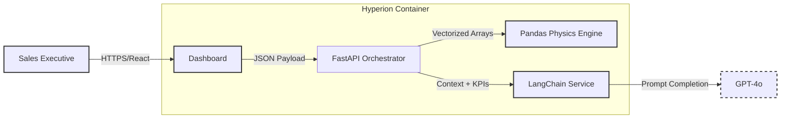
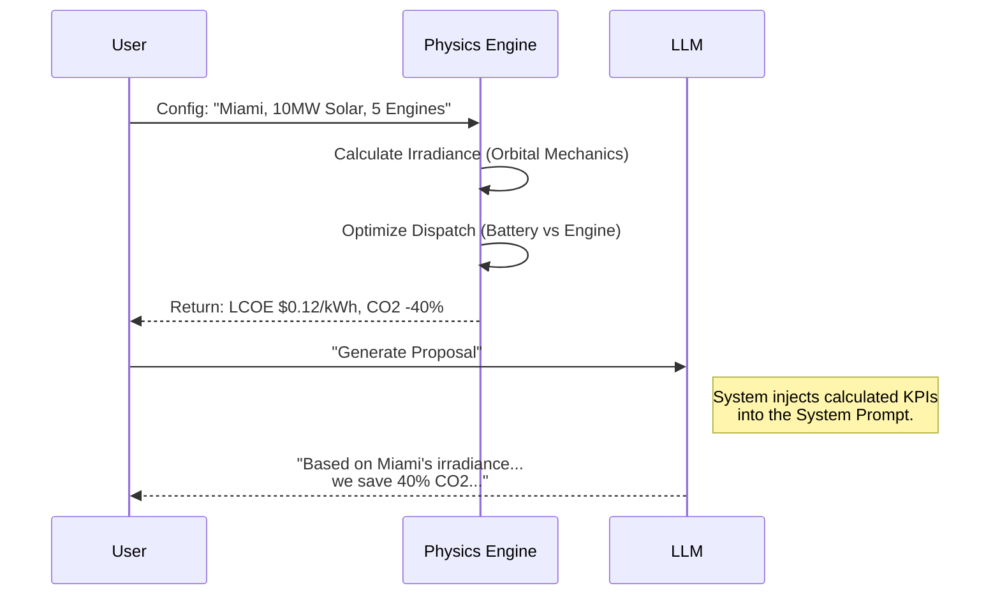

# Hyperion: Physics-Guided AI Sales Platform

[](https://youtu.be/Cp0jwLES0yo)

> 📺 **[Watch the System Demo](https://youtu.be/Cp0jwLES0yo)** featuring Vectorized Pandas Simulations and Context-Aware Generative AI.


-blueviolet?style=for-the-badge)


**Hyperion** is a technical sales acceleration platform designed for the Energy Sector. It solves the "Black Box" problem of AI by anchoring Generative content to a deterministic **Geospatial Physics Engine**.

---

## 1. Executive Summary & Business Value

Industrial energy sales (Microgrids, Hybrid Plants) suffer from long feedback loops. Sales engineers wait days for simulation teams to validate simple scenarios.

| KPI | Challenge | Hyperion Solution |
| :--- | :--- | :--- |
| **Sales Cycle Time** | 3-5 days for engineering team validation. | **< 200ms** real-time simulation via vectorized local compute. |
| **Proposal Accuracy** | Sales reps estimate numbers, leading to contract disputes. | **Physics-First Architecture:** Financials (LCOE, CAPEX) are calculated mathematically, not hallucinated by AI. |
| **Standardization** | Every proposal looks different and risks brand inconsistency. | **Templated AI Generation** ensures every PDF follows the corporate narrative while using dynamic site data. |

---

## 2. System Architecture (C4 Model)

We utilize a "Hybrid Intelligence" architecture where the Python backend handles the math, and the LLM handles the narrative.

### Level 1: System Context
Data flow between the User, the Compute Engine, and External AI Services.



### Level 2: The "Hybrid" Data Pipeline
How we prevent Hallucinations by forcing the AI to use pre-calculated data.



---

## 3. Architecture Decision Records (ADR)

Strategic choices balancing latency, accuracy, and cost.

| Component | Decision | Alternatives Considered | Justification (The "Why") |
| :--- | :--- | :--- | :--- |
| **Simulation Engine** | **Pandas / NumPy** | SQL Stored Procedures | **Latency:** Vectorized CPU operations in memory (<50ms) are orders of magnitude faster than database round-trips for 8,760-hour timeseries calculations. |
| **AI Strategy** | **Prompt Engineering (RAG-Lite)** | Fine-Tuned Model | **Accuracy:** Energy prices and physics don't change enough to warrant a fine-tune. Injecting real-time calculated KPIs into the context window guarantees 100% numerical accuracy (Zero Hallucination). |
| **Backend** | **FastAPI (Async)** | Flask / Django | **Concurrency:** We need to handle long-running OpenAI requests without blocking the high-speed simulation endpoints. FastAPI's native `async/await` handles this I/O bound traffic efficiently. |

---

## 4. FinOps: Cost & Latency Modeling

**Scenario:** 100 Sales Reps generating 50 proposals/day each.

| Resource | Unit Cost | Monthly Est. | Optimization |
| :--- | :--- | :--- | :--- |
| **Physics Compute** | $0 (Local CPU) | $0.00 | Calculations run on the container CPU. No external API calls required for math. |
| **AI Generation** | $0.01 / Proposal | ~$150.00 | **Context Pruning:** We only send the final aggregated KPIs (approx 500 tokens) to the LLM, not the full hourly timeseries data. |
| **Database** | $15 / month | $15.00 | Storing configuration metadata (KB size) is trivial compared to timeseries storage. |

---

## 5. Reliability & Security Strategy

### Input Validation (Guardrails)
* **Pydantic Validators:** The physics engine crashes if fed invalid data (e.g., negative battery capacity). We implement strict Pydantic models to catch `NaN` or impossible values at the API gate, protecting the simulation logic.

### Fallback Mechanisms
* **AI Degradation:** If OpenAI API fails (503), the system falls back to a **Deterministic Template**. The user still gets a proposal with the correct charts and numbers, just without the custom "flair" text.

---

## 6. Implementation & Validation

### Validation Framework
We treat the Physics Engine as "Mission Critical" code.
* **100% Unit Test Coverage:** Pytest suite validates the `calculations.py` module against known Excel benchmarks.
* **Integration Tests:** `AsyncMock` is used to simulate OpenAI responses, ensuring the CI/CD pipeline runs offline and incurs zero cost.

---

### Why this exists
Industrial energy sales require complex calculations to prove value. Spreadsheets are error-prone, and static PDFs don't scale. Hyperion solves this by:

1. **Geospatial Physics Engine:** Instead of static estimates, it uses a **Pandas/NumPy engine** to model solar irradiance based on **Latitude and Orbital Mechanics**. It simulates a site-specific 24-hour hybrid dispatch cycle (Solar + Industrial Gas Engine + Battery).
2. **Instant Financial Feedback:** Calculates **LCOE** (Levelized Cost of Electricity), CAPEX, and CO2 reduction metrics in real-time.
3. **Context-Aware AI Automation:** Uses **LangChain & GPT-4o** to instantly draft technical proposals. The AI analyzes the **geospatial data** (e.g., solar seasonality at high latitudes) to generate location-specific value propositions.

---

## System Architecture

The application is built on a containerized Microservices architecture:

1. **Frontend (React + TypeScript):** A high-performance dashboard using **Material UI** and **Recharts** for real-time visualization of energy profiles.
2. **Calculation Engine (Python + Pandas):** A vectorised simulation layer that generates synthetic solar data and optimizes dispatch logic (Solar → Battery → Engine).
3. **Backend API (FastAPI):** Asynchronous orchestration handling simulation requests and DB transactions.
4. **Database (PostgreSQL):** Persists hardware specifications (Products) and user configurations.
5. **AI Service (LangChain):** Chains simulation KPIs into prompt templates to generate context-aware sales pitches.

## Key Features

- **Geospatial Configurator:** Sliders to adjust **Site Latitude**, Engine Count, Solar MW, and Battery MWh to model any location globally.
- **Orbital Physics Engine:** Calculates real-time solar irradiance based on Earth-Sun geometry (Declination & Elevation), visualizing the "Duck Curve" effect where engines ramp down as solar peaks.
- **Financial Modeling:** Automatic calculation of **LCOE** (Levelized Cost of Electricity), Total CAPEX, and CO2 Savings vs Coal baseline.
- **Context-Aware AI Agent:** "One-Click" generation of vendor-neutral executive summaries that analyze **site-specific solar seasonality** and reliability data.

---

## Tech Stack

### Backend & Data
- **Framework:** FastAPI (Async Python 3.10)
- **Simulation:** Pandas, NumPy (Vectorized Operations)
- **AI:** LangChain, OpenAI GPT-4o-mini
- **Database:** PostgreSQL 15, SQLAlchemy (ORM), Pydantic (Validation)

### Frontend
- **Core:** React 18, Vite, TypeScript
- **UI Library:** Material UI (MUI v5)
- **Visualization:** Recharts (D3-based wrapper)
- **Networking:** Axios

### DevOps
- **Containerization:** Docker, Docker Compose
- **Hot Reloading:** Configured for both Frontend & Backend dev capability.

---

## Getting Started

### Prerequisites

- Docker Desktop installed
- OpenAI API Key

### Installation

1.  **Clone the repository**
    ```bash
    git clone https://github.com/Nibir1/Hyperion.git
    cd Hyperion
    ```

2.  **Set Environment Variables**
    Create a `.env` file in the root or export the key directly:
    ```bash
    export OPENAI_API_KEY=sk-proj-xxxx...
    ```

3.  **Build and Run**
    ```bash
    make build
    ```

Make build command internally runs:

```bash
docker-compose build --no-cache
docker-compose up -d
@echo "Application running at http://localhost:3000"
```

### Testing & Validation

This project includes a comprehensive test suite using **Pytest** that covers **100% of the critical calculation logic** and API endpoints.

The tests run inside the Docker container to ensure environment consistency. We use:
- **In-Memory SQLite:** To perform fast, isolated database integration tests without affecting the persistence layer.
- **Unittest Mocks:** To simulate OpenAI API calls, ensuring the test suite is zero-cost and runs offline.
- **Pytest-Cov:** To verify code coverage metrics.

To run the full test suite and view the coverage report:

```bash
make tests
```

### Access Points

- **Frontend Dashboard:** [http://localhost:3000](http://localhost:3000)
- **Backend Swagger Docs:** [http://localhost:8000/docs](http://localhost:8000/docs)

---

## How It Works

### 1. The Physics Simulation (`calculations.py`)
Hyperion doesn't guess; it calculates.
- **Solar:** Generates a Gaussian bell curve peaking at 12:00 PM.
- **Battery:** Detects evening peak demand (18:00-21:00) and discharges stored energy.
- **Engines:** Fill the remaining "Net Load" gap to ensure 100% reliability.

### 2. The AI Workflow (`ai_service.py`)
1. User clicks "Generate Proposal".
2. Backend runs the simulation to get final KPIs (e.g., "45,000 Tons CO2 Saved").
3. LangChain injects these numbers into a prompt template.
4. LLM returns a cohesive paragraph explaining *why* this specific configuration is profitable.

---

## Project Structure

```text
Hyperion/
├── docker-compose.yml       # Orchestration
├── backend/
│   ├── app/
│   │   ├── api/             # API Routes
│   │   ├── main.py          # Entry Point & Lifespan
│   │   ├── calculations.py  # Pandas Simulation Engine
│   │   ├── ai_service.py    # LangChain Logic
│   │   ├── models.py        # SQLAlchemy Tables
│   │   └── schemas.py       # Pydantic Models
│   └── requirements.txt
├── frontend/
│   ├── public/              # Static Assets (Logo)
│   ├── src/
│   │   ├── components/      # UI Blocks (Chart, Form, KPIs)
│   │   ├── services/        # API Integration
│   │   └── App.tsx          # Main Dashboard Logic
│   └── package.json
└── README.md
```

## Roadmap
- [x] Core Simulation Engine (Solar/Engine/Battery)
- [x] Financial Logic (LCOE/Capex)
- [x] GenAI Proposal Integration
- [ ] User Auth (Save Projects per User)
- [ ] PDF Export of Charts

Architected by **Nahasat Nibir**
*Senior AI & Data Solutions Architect*
